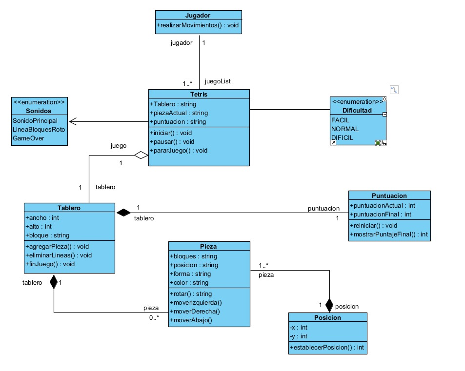

# Juego Tetris

**Integrantes:** Nathaly Camacho, Iván Fernandez, José Riofrío, Ariana Sarango.

**Ciclo:** Segundo "A"

# Diagrama UML 

# GitHub Page

        https://arianasarango.github.io/Tetris/

# Estructura Proyecto

## Clases Principales

### 1. Jugador

Representa al jugador del juego.

**Métodos:**
        
- realizarMovimientos(): Permite al jugador realizar movimientos en el juego.

### 2. Tetris

Controla la lógica principal del juego Tetris.
    
**Atributos:** 
- Tablero: Referencia al objeto Tablero asociado. 
- piezaActual: La pieza que está actualmente en juego. 
- puntuacion: Puntuación actual del juego.

**Métodos:**
- iniciar(): Inicia el juego. 
- pausar(): Pausa el juego.
- pararJuego(): Detiene el juego.

**Relaciones:**
 - Un Jugador puede tener múltiples instancias de Tetris (juegoList).
 - Composición con Tablero, Puntuacion y una enumeración Dificultad.

### 3. Tablero

Representa el tablero de juego donde las piezas se colocan.
    
**Atributos:**
- ancho: Ancho del tablero.
- alto: Alto del tablero.
- bloque: Representación de los bloques en el tablero.
   
**Métodos:**
- agregarPieza(): Agrega una nueva pieza al tablero.
- eliminarLineas(): Elimina las líneas completas del tablero. 
- finJuego(): Finaliza el juego.
    
**Relaciones:**
- Composición con múltiples instancias de Pieza.

### 4. Pieza

Representa las piezas que caen en el tablero.
    
**Atributos:**
- bloques: Bloques que conforman la pieza.
- posicion: Posición actual de la pieza en el tablero.
- forma: Forma de la pieza.
- color: Color de la pieza.
   
**Métodos:**
- rotar(): Rota la pieza.
- moverIzquierda(): Mueve la pieza a la izquierda.
- moverDerecha(): Mueve la pieza a la derecha.
- moverAbajo(): Mueve la pieza hacia abajo.
    
**Relaciones:**
- Cada Pieza tiene una Posicion.

### 5. Puntuacion

Gestiona la puntuación del juego.
    
**Atributos:**
- puntuacionActual: Puntuación actual durante el juego.
- puntuacionFinal: Puntuación final del juego.
    
**Métodos:**
- reiniciar(): Reinicia la puntuación.
- mostrarPuntajeFinal(): Muestra la puntuación final.

### 6. Posicion

Representa la posición (x, y) de una pieza en el tablero.
    
**Atributos:**
- x: Coordenada x de la posición.
- y: Coordenada y de la posición.
   
**Métodos:**
- establecerPosicion(): Establece la posición de la pieza.

### 7. Enumeraciones
Sonidos:
- SonidoPrincipal 
- LineaBloquesRoto 
- GameOver

### 8. Dificultad

Valores:

- FACIL
- NORMAL 
- DIFICIL
